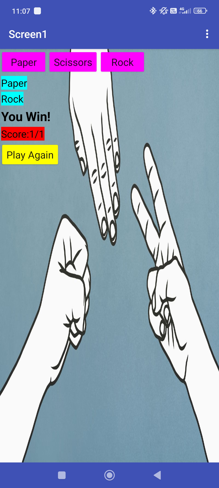

# Rock-scissors
A simple and interactive Rock Paper Scissors mobile game created using MIT App Inventor. The game allows the player to choose Rock, Paper, or Scissors and compete against a randomly generated computer choice.

# ✊ Rock Paper Scissors Game

A simple **Rock Paper Scissors mobile game** developed using **MIT App Inventor**.

The game allows the player to choose Rock, Paper, or Scissors and compete against a randomly generated computer choice.

## 📱 Preview

## ✨ Features

- 🪨 Rock, Paper and Scissors choices
- 🤖 Random computer choice
- 🏆 Win, Lose and Draw detection
- 📊 Live score tracking
- 🔄 Play Again functionality
- 📱 Android mobile application
- 🎨 Simple and interactive user interface

## 🛠️ Technologies Used

- **MIT App Inventor**
- **Block-based Programming**
- **Android**
- Variables
- Conditional Statements
- Random Number Generation
- Buttons and Labels

## 🎮 Game Logic

The winner is determined using the standard Rock Paper Scissors rules:

| Player Choice | Beats |
|---|---|
| 🪨 Rock | ✂️ Scissors |
| 📄 Paper | 🪨 Rock |
| ✂️ Scissors | 📄 Paper |

If both the player and computer choose the same option, the round is a **Draw**.

## 🚀 How to Run

1. Download the `.aia` project file.
2. Open **MIT App Inventor**.
3. Go to **Projects → Import project (.aia) from my computer**.
4. Select the `.aia` file.
5. Run the project using an Android device or emulator.

## 🧠 What I Learned

This project helped me understand:

- Event-driven programming
- Conditional logic
- Random number generation
- Variables and score management
- User interaction
- Basic mobile application development

## 🔮 Future Improvements

- Add sound effects
- Add animations
- Add best-of-3 mode
- Add game history
- Improve the user interface
- Add multiplayer mode

## 👨‍💻 Author

Wapongtemsu Jamir

Built using **MIT App Inventor** as a learning project.

---
